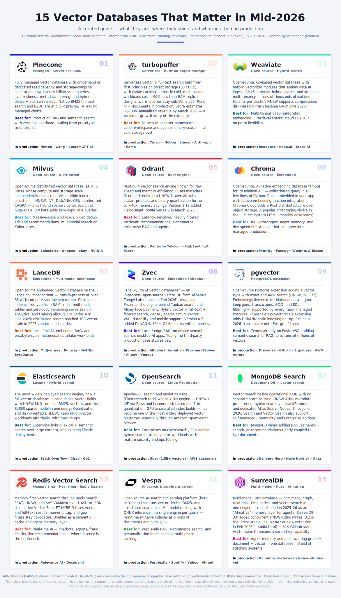

*Updated July 10, 2026*

A critically curated list — production-usage and momentum claims were checked
against official case studies, customer pages, engineering blogs, release notes,
and funding announcements through July 10, 2026. Vendor-reported metrics and
third-party estimates are labeled as such. Source links follow each entry.

See the companion
[_Vector Databases Infographic_](vector-databases-infographic.svg):

ANN *libraries* — engines you embed, not databases you run — are covered
separately: see [_Vector Search Libraries Summary_](../../../07/01/vector-search-libraries-summary/)
and [_Vector Search Libraries Infographic_](../../../07/01/vector-search-libraries-summary/vector-search-libraries-infographic.svg)
(FAISS, hnswlib, Turbovec, ScaNN, DiskANN, Annoy, Voyager, usearch, NVIDIA
cuVS).

---

## 1.  Pinecone — Managed · Serverless SaaS

[pinecone.io](https://www.pinecone.io/)

Pinecone is a fully managed, cloud-native vector database delivered as a
serverless SaaS, with on-demand or dedicated read capacity and a BYOC option in
public preview. Its architecture separates storage from compute while keeping
query latency low at billion-vector scale, with live index freshness, metadata
filtering, hybrid dense + sparse search, and native BM25 full-text search in
public preview. It is closed-source, so its value proposition is operational
simplicity rather than self-hosting flexibility. The category pioneer, and still
a leading managed choice.

**Best fit:** teams that want production-grade RAG, semantic search, or
recommendations fast, without a DevOps burden.

**In production:** Notion (Notion AI search/Q&A, billions of embeddings), Gong
(Smart Trackers AI, 10x cost reduction on serverless), CustomGPT.ai (400M+
vectors, <20ms P50), Melange (patent search).

**Sources:**
[pinecone.io/customers](https://www.pinecone.io/customers/)
· [Gong](https://www.pinecone.io/customers/gong/)
· [CustomGPT.ai](https://www.pinecone.io/customers/customgpt-ai/)
· [2026 release notes](https://docs.pinecone.io/release-notes/2026)

## 2.  turbopuffer — Serverless · Built on object storage

[turbopuffer.com](https://turbopuffer.com/)

turbopuffer is a serverless vector + full-text/hybrid search engine built from
the first principles on object storage (S3/GCS) with NVMe/RAM caching, founded
by Simon Eskildsen (ex-Shopify). The architecture makes huge, mostly cold,
multi-tenant namespace workloads cost roughly one-tenth as much as
RAM/disk-replica vector DBs while keeping warm queries at sub-10ms p50. It runs
4T+ documents, 10M+ writes/s, and 25K+ queries/s in production, and reached an
estimated
~\$100M annualized revenue by March 2026 (up ~2,400% YoY) on less than \$1M of
primary capital — the defining growth story of the category.

**Best fit:** AI-native products with millions of per-user or per-workspace
namespaces where most data is cold — code search, workspace search, agent
memory — and cost-driven migrations off RAM-based hosted vector DBs.

**In production:** Cursor (1T+ code chunks, 80M+ namespaces, ~95% cost cut),
Notion (10B+ vectors, ~80% cost reduction), Linear; Anthropic, Atlassian, Ramp,
Grammarly, and Harvey are also listed customers.

**Sources:**
[Google Cloud case study](https://cloud.google.com/customers/turbopuffer)
· [Sacra](https://sacra.com/c/turbopuffer/)
· [AWS Startups](https://aws.amazon.com/startups/learn/how-turbopuffer-is-refactoring-the-economics-of-search)
· [turbopuffer.com/customers](https://turbopuffer.com/customers)

## 3.  Weaviate — Open source · Hybrid search

[weaviate.io](https://weaviate.io/)

Weaviate is an open-source (BSD-3), cloud-native vector database written in Go,
available self-hosted or as Weaviate Cloud. It stands out for built-in
"vectorizer" modules that embed data at ingest time (OpenAI, Cohere, Hugging
Face, etc.), native BM25 + vector hybrid search, and multi-tenancy that isolates
tens of thousands of tenants in a single cluster. HNSW indexing with PQ/BQ/SQ
compression lets teams tune the cost/recall trade-off. Weaviate 1.38 made
HFresh, its disk-based vector index for streaming workloads, generally available
in June 2026 and also graduated its built-in MCP server to GA.

**Best fit:** SaaS products needing per-customer data isolation at scale,
RAG/agent platforms wanting an integrated embedding + retrieval stack, and
enterprises needing flexible deployment (cloud, BYOC, on-prem).

**In production:** Instabase (50K+ tenants in one cluster), Kapa.ai (AI chatbots
for 100+ companies including Docker, OpenAI, and Reddit), Stack AI, Neople.

**Sources:**
[Instabase](https://weaviate.io/case-studies/instabase)
· [Kapa.ai](https://weaviate.io/case-studies/kapa)
· [Stack AI](https://weaviate.io/case-studies/stack-ai)
· [Weaviate 1.38](https://weaviate.io/blog/weaviate-1-38-release)

## 4.  Milvus — Open source · Distributed

[milvus.io](https://milvus.io/)

Milvus is an open-source (Apache 2.0) distributed vector database — a graduated
LF AI & Data Foundation project created by Zilliz, with Zilliz Cloud as the
managed offering. Its architecture fully separates compute and storage into
independently scalable microservices, supporting deployments of tens of billions
of vectors. It offers a wide range of index types (HNSW, IVF, DiskANN, GPU
indexes via NVIDIA CAGRA) plus hybrid sparse/dense search and multi-tenancy.
Milvus 3.0 entered public beta in May 2026, adding zero-copy queries over
external lake tables and a more lake-native, multimodal architecture.

**Best fit:** large enterprises with billion-scale workloads — video/image
dedup, ad recommendation, multimodal search — and Kubernetes-native shops.

**In production:** Salesforce (100+ internal tenants), Shopee (video recall,
dedup at a billions-of-vectors scale), eBay (ad recommendation), NVIDIA (DRIVE);
PayPal and Airbnb also named among 300+ enterprises.

**Sources:**
[Milvus 40K-stars post](https://milvus.io/blog/milvus-exceeds-40k-github-stars.md)
· [milvus.io/use-cases](https://milvus.io/use-cases)
· [Milvus 3.0 beta](https://milvus.io/docs/release_notes.md)

## 5.  Qdrant — Open source · Rust engine

[qdrant.tech](https://qdrant.tech/)

Qdrant is an open-source (Apache 2.0) vector similarity search engine written in
Rust, self-hostable via a single binary/Docker or as Qdrant Cloud (with
GPU-accelerated indexing and multi-AZ clusters). Its strengths are raw
performance and memory efficiency, advanced payload filtering fused directly
into HNSW graph traversal, and aggressive quantization — scalar, product, and
binary, up to ~40x memory reduction. Qdrant 1.18 added TurboQuant in May 2026;
momentum also includes a \$50M Series B closed in March 2026 (~\$88M total
raised).

**Best fit:** latency-sensitive production workloads with rich metadata
filters — recommendations, enterprise RAG/agents, e-commerce search.

**In production:** Deutsche Telekom ("Frag Magenta" multi-agent platform, 2M+
conversations across 10 countries), HubSpot (Breeze AI retrieval), plus xAI
(Grok), Tripadvisor, Canva, and Flipkart on its customers’ page.

**Sources:**
[Deutsche Telekom](https://qdrant.tech/blog/case-study-deutsche-telekom/)
· [HubSpot](https://qdrant.tech/blog/case-study-hubspot/)
· [qdrant.tech/customers](https://qdrant.tech/customers/)
· [Series B](https://qdrant.tech/blog/series-b-announcement/)
· [Qdrant 1.18](https://qdrant.tech/blog/qdrant-1.18.x/)

## 6.  Chroma — Open source · Embedded

[trychroma.com](https://www.trychroma.com/)

Chroma is an open-source, AI-native embedding database (with managed Chroma
Cloud) known for its extremely simple developer API — create a collection, add
documents, query, in a handful of lines. It runs embedded in Python/TypeScript
applications, integrates embedding functions natively, and supports metadata
filtering plus full-text + vector hybrid retrieval; Chroma Cloud adds a
Rust-rewritten distributed core over object storage. It is a popular prototyping
choice of the LLM ecosystem, with deep LangChain/LlamaIndex integration and 15M+
monthly downloads, according to Chroma's official site.

**Best fit:** RAG, agent memory, semantic document/code search, and
small-to-mid-scale AI apps where developer speed matters most.

**In production:** Mintlify (docs for Coinbase, PayPal, Anthropic), Factory
(Droid coding agents), Propel, Weights & Biases (WandBot).

**Sources:**
[Mintlify](https://www.trychroma.com/customers/mintlify-case-study)
· [Factory](https://www.trychroma.com/customers/factory-ai-case-study)
· [Propel](https://www.trychroma.com/customers/propel-ai-case-study)
· [Chroma research](https://research.trychroma.com/generative-benchmarking)

## 7.  LanceDB — Embedded · Multimodal lakehouse

[lancedb.com](https://lancedb.com/)

LanceDB is an open-source embedded + cloud vector database built on the Lance
columnar format (Rust), designed to run in-process or scale over object storage
like S3 with compute-storage separation. Strengths: zero-infrastructure
operation, native multimodal data handling (vectors, text, images, video in one
table), fast disk-based indexing so datasets aren't RAM-bound, and data
versioning with zero-copy schema evolution — a "multimodal lakehouse" where the
same files serve search, analytics, and training. Momentum: a \$30M Series A in
June 2025 led by Theory Ventures, with CRV, YC, and Databricks Ventures (\$41M
total), followed by 10-billion-vector distributed-search work in 2026.

**Best fit:** multimodal training/retrieval pipelines, embedded (serverless)
RAG, and petabyte-scale AI data lakes.

**In production:** Midjourney and Runway (billions of vectors, petabytes of
multimodal data), Netflix (Media Data Lake), ByteDance and UBS (customers’
page), Metagenomi (1B+ protein embeddings on S3), CodeRabbit.

**Sources:**
[Series A](https://www.lancedb.com/blog/series-a-funding)
· [lancedb.com/customers](https://www.lancedb.com/customers)
· [Netflix case study](https://www.lancedb.com/blog/case-study-netflix)
· [10B-scale search](https://www.lancedb.com/blog/how-lancedb-accelerates-vector-search-at-10-billion-scale)
· [AWS Architecture Blog](https://aws.amazon.com/blogs/architecture/a-scalable-elastic-database-and-search-solution-for-1b-vectors-built-on-lancedb-and-amazon-s3/)

## 8.  Zvec — Open source · Embedded (Alibaba)

[zvec.org](https://zvec.org/en/)

Zvec, launched February 2026 by Alibaba's Tongyi Lab, is an open-source (Apache
2.0), in-process vector database positioned as "the SQLite of vector databases."
It wraps Proxima, Alibaba's internal vector engine that has run for years inside
Taobao search, Alipay face payment, and Youku video search, and supports hybrid
vector + full-text + filtered search, dense/sparse/multi-vector, WAL durability,
and mobile (Android/iOS) targets. Version 0.5 added native full-text search and
a DiskANN index in June 2026. Traction has been exceptional: 6K+ GitHub stars in
its first two weeks and ~12.4K by mid-2026, with two front-page Hacker News
threads.

Caveats, clearly flagged: it is five months old, benchmark claims await
independent verification (Simon Willison publicly asked for it), and there are
no third-party production case studies yet — the "battle-tested" claim belongs
to the underlying Proxima engine inside Alibaba.

**Best fit:** local/edge RAG, on-device semantic search, and desktop AI apps —
anywhere you'd otherwise stitch together FAISS + SQLite.

**In production:** Alibaba internal via Proxima (Taobao, Alipay, Youku); no
external production users documented yet.

**Sources:**
[github.com/alibaba/zvec](https://github.com/alibaba/zvec)
· [zvec.org](https://zvec.org/en/) ·
[Zvec 0.5](https://zvec.org/en/blog/2026-06-12-zvec-release/) ·
[Hacker News](https://news.ycombinator.com/item?id=47000535) ·
[trendshift](https://trendshift.io/repositories/20830)

## 9.  pgvector — PostgreSQL extension

[github.com/pgvector/pgvector](https://github.com/pgvector/pgvector)

pgvector is an open-source PostgreSQL extension that adds a `vector` column type
plus exact and approximate nearest-neighbor search (HNSW and IVFFlat) with L2,
inner-product, and cosine distances — directly inside Postgres. Embeddings live
next to relational data, so you keep joins, transactions, ACID guarantees, and
SQL filtering with no separate vector service; every major managed Postgres
supports it. Timescale's DiskANN-based **pgvectorscale** extension layers on
higher-performance indexing, fueling a visible 2026 "consolidate back onto
Postgres" trend.

**Best fit:** teams already on Postgres adding semantic search, RAG, or
recommendations up to tens of millions of vectors. Less ideal for billion-scale
pure-vector workloads.

**In production:** Discourse (Discourse AI embeddings), GitLab (Duo semantic
search), Supabase (Supabase Vector), AWS (production guidance on Aurora
PostgreSQL).

**Sources:**
[Discourse](https://meta.discourse.org/t/discourse-ai-embeddings/259603)
· [GitLab](https://docs.gitlab.com/development/ai_features/semantic_search/)
· [Supabase](https://supabase.com/modules/vector)
· [AWS blog](https://aws.amazon.com/blogs/database/running-pgvector-in-production-on-amazon-aurora-postgresql/)
· [pgvectorscale](https://github.com/timescale/pgvectorscale)

## 10.  Elasticsearch — Lucene · Hybrid search

[elastic.co/elasticsearch](https://www.elastic.co/elasticsearch)

Elasticsearch, the most widely deployed search engine, becomes a full-featured
vector database through its `dense_vector` field type with HNSW-based
approximate kNN on Lucene. Its standout strength is hybrid retrieval at scale:
BM25 lexical search, vector kNN, the built-in ELSER sparse-embedding model,
filters, and aggregations combine in one query. BBQ/int8/int4 quantization and
the disk-oriented DiskBBQ index keep billion-vector workloads affordable;
Elasticsearch 9.4 added faster native-SIMD DiskBBQ scoring in 2026. It also
brings mature distributed-systems tooling — sharding, replication, security,
observability — that pure-play vector DBs often lack.

**Best fit:** enterprise search, e-commerce, and RAG needing lexical + semantic
hybrid ranking over large heterogeneous corpora.

**In production:** Stack Overflow (hybrid search behind OverflowAI), Cisco
(enterprise search + generative AI), Go1 (intent-aware course recommendations).

**Sources:**
[Stack Overflow](https://www.elastic.co/customers/stack-overflow)
· [Cisco via SiliconANGLE](https://siliconangle.com/2023/08/31/revolutionizing-enterprise-search-elasticsearch-cisco-harness-generative-ai-googlecloudnext/)
· [DiskBBQ in Elasticsearch 9.4](https://www.elastic.co/search-labs/blog/vector-search-diskbbq-simd-block-scoring)

## 11.  OpenSearch — Open source · Linux Foundation

[opensearch.org](https://opensearch.org/)

OpenSearch is the Apache-2.0 search and analytics suite (forked from
Elasticsearch, now governed by the Linux Foundation) whose k-NN vector engine —
HNSW/IVF via Faiss and Lucene, disk-based and 1-bit quantization,
GPU-accelerated index builds — has quietly become one of the most widely
deployed vector search platforms, especially through Amazon OpenSearch Service (
the default vector store for Amazon Bedrock knowledge bases). The marquee proof
point is Uber's engineering write-up on serving 1.5B+ vectors with measurable
revenue lift from semantic search.

**Best fit:** enterprises already on OpenSearch/ELK adding hybrid lexical +
vector retrieval, and billion-vector workloads needing mature security,
multi-tenancy, and ops tooling.

**In production:** Uber (billion-scale vector search), broad AWS customer
deployments via OpenSearch Service.

**Sources:**
[Uber engineering](https://www.uber.com/blog/powering-billion-scale-vector-search-with-opensearch/)
· [InfoQ](https://www.infoq.com/news/2025/12/uber-opensearch-vector-semantic/)
· [AWS GPU-accelerated builds](https://aws.amazon.com/blogs/big-data/build-billion-scale-vector-databases-in-under-an-hour-with-gpu-acceleration-on-amazon-opensearch-service/)
· [OpenSearch 3.7](https://opensearch.org/blog/explore-opensearch-3-7/)

## 12.  MongoDB Vector Search — Document DB + vectors

[mongodb.com/products/platform/atlas-vector-search](https://www.mongodb.com/products/platform/atlas-vector-search)

MongoDB Vector Search stores embeddings alongside operational JSON data with no
separate vector store to sync. It uses HNSW-based ANN indexing, supports
pre-filtering on document metadata, hybrid search via `$rankFusion`, and
dedicated Search Nodes for workload isolation in Atlas. In June 2026, MongoDB
made hybrid search generally available and extended Search and Vector Search to
self-managed Community and Enterprise deployments. Its key strength is
architectural simplicity: one database, one driver, and one query API for
transactional data, full-text, and vector search.

**Best fit:** teams already on MongoDB adding RAG, semantic search, or
recommendations tightly coupled to live documents.

**In production:** Delivery Hero (real-time grocery substitution
recommendations), Novo Nordisk (NovoScribe clinical report generation), Okta
(natural-language identity queries), Kovai/Document360.

**Sources:**
[Delivery Hero](https://www.mongodb.com/solutions/customer-case-studies/delivery-hero-vector-search)
· [Novo Nordisk](https://www.mongodb.com/solutions/customer-case-studies/novo-nordisk-atlas)
· [Okta](https://www.mongodb.com/solutions/customer-case-studies/okta)
· [June 2026 product announcement](https://www.mongodb.com/company/newsroom/press-releases/mongodb-delivers-accurate-ai-retrieval-wherever-enterprise-data-lives)

## 13.  Redis Vector Search — Memory-first · Real-time

[redis.io/search](https://redis.io/search/)

Redis provides vector search through Redis Search and its Redis Query Engine
(formerly the RediSearch module, now integrated into Redis 8 and Redis Cloud).
It indexes embeddings stored in HASH or JSON structures with FLAT, HNSW, or the
memory-efficient SVS-VAMANA algorithm; Redis 8 also offers native Vector Sets.
The `FT.HYBRID` command combines vector and full-text results with score fusion.
Its defining strength is sub-millisecond to single-digit-millisecond latency,
plus text, numeric, tag, and geo filtering co-located with vectors. It also
doubles as a semantic cache and agent-memory layer.

**Best fit:** real-time AI (chatbots, agents, fraud checks, live
recommendations) where retrieval latency is the bottleneck. Memory-first
economics still deserve scrutiny for very large, mostly cold corpora.

**In production:** Relevance AI (sub-ms vector search for AI agents), Docugami
(RAG over long-form documents). These are the clearly documented official
vector-search case studies; Redis-the-cache is, of course, ubiquitous.

**Sources:**
[Relevance AI](https://redis.io/customers/relevance-ai/)
· [Docugami](https://redis.io/customers/docugami/)
· [2026 vector-index guide](https://redis.io/blog/vector-indexes-in-redis/)

## 14.  Vespa — AI search & serving platform

[vespa.ai](https://vespa.ai/)

Vespa is a full open-source AI search and serving platform (born at Yahoo, spun
out as Vespa.ai in 2023) that combines vector search, lexical/BM25 search,
structured filtering, and machine-learned ranking with ONNX model inference —
all in one engine at serving time. Technical strengths: true hybrid retrieval
with multiphase ranking, real-time indexing with mutable documents, tensor
computation, and horizontal scale to billions of documents and hundreds of
thousands of QPS. It's heavier to learn and operate than a simple vector store;
Vespa Cloud offers a managed option.

**Best fit:** large-scale, latency-critical systems — web-scale RAG, e-commerce
search, personalization feeds — where vectors, filters, text relevance, and ML
ranking must combine per query.

**In production:** Perplexity (100M+ queries/week), Spotify (search + podcast
personalization, 600M+ MAU), Yahoo (~150 apps, ~1B users, ~800K QPS), Vinted
(plus OKCupid, OTTO, Elicit).

**Sources:**
[vespa.ai/perplexity](https://vespa.ai/perplexity/)
· [vespa.ai/case-studies](https://vespa.ai/case-studies/)

## 15.  SurrealDB — Multi-model · Rust · AI-native

[surrealdb.com](https://surrealdb.com/)

SurrealDB is a London-based multi-model database written in Rust — document,
graph, relational, time-series, and vector search in one engine — that
repositioned in 2025–26 as an "AI-native" memory layer for agents. SurrealDB
3.0 (Feb 2026) shipped concurrent HNSW-index writes and other indexing
improvements aimed at agentic AI workloads; 3.2 became the latest stable line in
July. Momentum is real: a \$23M Series A extension in Feb 2026 (~\$44M total;
Chalfen Ventures, Begin Capital, FirstMark, Georgian), ~31K GitHub stars, and
2.3M downloads.

Caveat, clearly flagged: vector search is a secondary capability, and there are
no named public production case studies for it yet — this is a momentum
inclusion.

**Best fit:** agent memory and applications that want graph + document + vector
in a single database instead of stitching systems together.

**In production:** no named vector-search case studies yet; investor statements
reference enterprise momentum.

**Sources:**
[Funding announcement](https://surrealdb.com/blog/surrealdb-raises-23m-series-a-extension-to-power-the-ai-native-database-era)
· [TechTarget](https://www.techtarget.com/searchdatamanagement/news/366639042/SurrealDB-raises-23M-launches-update-to-fuel-agentic-AI)
· [SurrealDB releases](https://surrealdb.com/releases)

---

## Evaluated but excluded

**[pgvectorscale](https://github.com/timescale/pgvectorscale) / ParadeDB** —
credible Postgres add-ons (DiskANN-style indexing; BM25 hybrid) riding the
Postgres-consolidation trend; covered within the pgvector entry rather than as
standalone entries.

**Marqo, Vald** — no meaningful 2026 growth signals.

**ClickHouse, Couchbase, [HCL Informix VectorBlade](https://www.actian.com/blog/product-launches/introducing-native-vector-search-with-hcl-informix-vectorblade/
)** — vector search is a feature of a broader database rather than a headline
capability.

**Azure AI Search, Vertex AI Vector Search** — steady cloud-incumbent adoption
but no distinct growth story.

**Actian VectorAI DB** — a notable [April 2026 launch](https://www.actian.com/company/press-releases/actian-launches-vectorai-db-with-22x-faster-vector-search-for-production-ai-anywhere-including-the-edge/
) aimed at regulated, disconnected, and edge deployments, but too new to meet
the list's documented production-adoption criterion.

---

## Curation criteria

A database made the list if it met all three:
- (1) **verified production adoption** — named companies running it, documented
  in case studies or engineering blogs, not marketing lists alone (relaxed for
  Zvec and SurrealDB, included on momentum with their gaps explicitly flagged);
- (2) **momentum** — GitHub traction, funding, or revenue growth through
  mid-2026;
- (3) **developer mindshare** — presence in the tooling ecosystem
  (LangChain/LlamaIndex integrations, HN/community discussion).

It also had to actually be a *database* (or a database's first-class vector
capability) — pure ANN index libraries get their own companion infographic
instead.

---

## Logo notes

All official marks, embedded inline as pure vector SVG: Pinecone (official icon
via gilbarbara/logos — Pinecone publishes no public SVG brand kit),
turbopuffer (official site mark), Weaviate (official transparent-background
logomark from weaviate.io), Milvus (current official mark extracted from the
milvus.io header, #00B3FF), Qdrant (official icon via gilbarbara/logos),
Chroma (trychroma.com), LanceDB (official docs icon, recolored to brand coral
#FF734A), Zvec (zvec.org, cropped to logomark), Elasticsearch (official
multicolor cluster mark), OpenSearch / MongoDB / Redis
(official logomark shapes via Simple Icons), Vespa (mark extracted from the
current vespa.ai site header — the post-2023-spinout brand is a black angular
double-chevron "V"; older Vespa logos look different, and this is vespa.ai the
search company, not the scooter brand), SurrealDB (official layered-S icon via
gilbarbara/logos). Notes: **pgvector** has no logo of its own, so the official
PostgreSQL elephant is used; **Redis** shows the current post-March-2024 rebrand
mark — and "Redis Vector" is not an official product name; the capability is
officially "Redis Search / vector search" (module: RediSearch).
