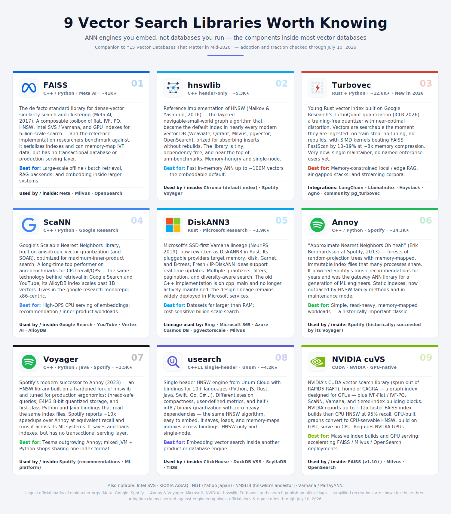

*Updated July 10, 2026*

These are ANN (Approximate Nearest Neighbor) **libraries** — engines you embed
in your own process, not databases you run. Many can serialize or memory-map
index files, but they do not provide database-level transactional durability,
WAL-backed recovery, CRUD APIs, replication, or a production serving layer. They
matter because they are the components *inside* most vector databases, and
because embedding one directly is often the right call for offline pipelines,
edge deployment, or maximum performance. Adoption and traction claims were
checked against engineering blogs, official documentation, and repositories
through July 10, 2026.

See the companion [*Vector Search Libraries
Infographic*](vector-search-libraries-infographic.svg):

Full-service vector databases are covered separately: see
[*Vector Databases Summary*](../../../06/30/vector-databases-summary/)
and
[*Vector Databases Infographic*](../../../06/30/vector-databases-summary/vector-databases-infographic.svg).

---

## 1.  FAISS — C++ / Python · Meta AI · ~41K★

[github.com/facebookresearch/faiss](https://github.com/facebookresearch/faiss)

FAISS (Facebook AI Similarity Search, 2017) is the de facto standard library for
dense-vector similarity search and clustering, and the reference implementation
researchers benchmark against. It is a composable toolbox of index types — flat
brute-force, IVF partitioning, product quantization, HNSW, Intel SVS/Vamana, and
GPU variants — that can be combined and tuned for billion-scale search. Since
v1.10 its GPU indexes have been co-developed with NVIDIA via cuVS; current
builds can also use Intel SVS graph implementations. FAISS can serialize indexes
and memory-map on-disk IVF data, but provides no transactional database or
production serving layer.

**Best fit:** large-scale offline/batch retrieval, RAG backends, and embedding
inside larger systems.

**Used by / inside:** Meta (billion-scale multimedia search), OpenSearch (Faiss
k-NN engine option), Milvus (index heritage), DoorDash (hybrid GenAI item
search).

**Sources:**
[Meta engineering](https://engineering.fb.com/2017/03/29/data-infrastructure/faiss-a-library-for-efficient-similarity-search/)
· [github.com/facebookresearch/faiss](https://github.com/facebookresearch/faiss)
· [cuVS in FAISS](https://engineering.fb.com/2025/05/08/data-infrastructure/accelerating-gpu-indexes-in-faiss-with-nvidia-cuvs/)
· [SVS in FAISS](https://github.com/facebookresearch/faiss/blob/main/INSTALL.md)
· [AWS OpenSearch k-NN](https://aws.amazon.com/blogs/big-data/choose-the-k-nn-algorithm-for-your-billion-scale-use-case-with-opensearch/)

## 2.  hnswlib — C++ header-only · ~5.3K★

[github.com/nmslib/hnswlib](https://github.com/nmslib/hnswlib)

hnswlib is the reference implementation of HNSW (Hierarchical Navigable Small
World graphs; Malkov & Yashunin, 2016) — the algorithm that became the default
index of nearly every modern vector database, including Weaviate, Qdrant,
Milvus, pgvector, and OpenSearch's Lucene engine. Its killer property versus
older tree/quantization methods is incremental construction: new vectors are
inserted into the graph without rebuilding the index. The library itself is
tiny, header-only, dependency-free, and consistently near the top of
ann-benchmarks. Trade-offs: the full vectors and graph live in RAM, and it is
single-node.

**Best fit:** fast in-memory ANN up to roughly 100M vectors — the embeddable
default.

**Used by / inside:** Chroma (default index), Spotify Voyager (built on a
hardened fork), and as the algorithmic basis of most vector-DB HNSW
implementations.

**Sources:**
[github.com/nmslib/hnswlib](https://github.com/nmslib/hnswlib)
· [HNSW paper (arXiv:1603.09320)](https://arxiv.org/abs/1603.09320)
· [Spotify on hnswlib](https://engineering.atspotify.com/2023/10/introducing-voyager-spotifys-new-nearest-neighbor-search-library)

## 3.  Turbovec — Rust + Python · ~12.6K★ · New in 2026

[github.com/RyanCodrai/turbovec](https://github.com/RyanCodrai/turbovec)

Turbovec (Ryan Codrai, June 2026) is a young Rust vector index with Python
bindings built on Google Research's TurboQuant quantization algorithm (ICLR
2026), a training-free quantizer with near-optimal distortion. Its pitch:
vectors are searchable the moment they are ingested — no train step, no tuning,
no rebuilds — with handwritten SIMD kernels reported to beat FAISS FastScan by
10–19% at roughly 8x memory compression (10M documents from 31GB to ~4GB), plus
bitmask filtering inside the search kernel. Star growth has been explosive
(~11.4K in two weeks).

**Caveats, clearly flagged:** a single maintainer, no named enterprise users
yet, and benchmark claims not yet independently reproduced. Not to be confused
with turbopuffer (the serverless search *database*) — they are unrelated
projects.

**Best fit:** memory-constrained local/edge RAG, air-gapped stacks, and
streaming corpora.

**Integrations / ecosystem:** first-party adapters for LangChain, LlamaIndex,
Haystack, and Agno; a community `pg_turbovec` Postgres extension. Qdrant 1.18
independently implements the underlying TurboQuant algorithm, not this library.

**Sources:**
[github.com/RyanCodrai/turbovec](https://github.com/RyanCodrai/turbovec)
· [trendshift](https://trendshift.io/repositories/26144)
· [Qdrant 1.18](https://qdrant.tech/blog/qdrant-1.18.x/)

## 4.  ScaNN — C++ / Python · Google Research

[github.com/google-research/google-research/tree/master/scann](https://github.com/google-research/google-research/tree/master/scann)

ScaNN (Scalable Nearest Neighbors) is Google's ANN library, built on anisotropic
vector quantization (ICML 2020) and SOAR (NeurIPS 2023), optimized specifically
for maximum-inner-product search — the operation at the heart of embedding
retrieval and recommendations. It has long sat at or near the top of
ann-benchmarks for CPU recall/QPS, and it is the same technology behind
retrieval in Google Search and YouTube; the ScaNN for AlloyDB index brought it
to PostgreSQL as the first Postgres-compatible index to scale past 1B vectors.
It lives inside the google-research monorepo and is x86/AVX2-centric, which
makes it less hackable than FAISS.

**Best fit:** high-QPS CPU serving of embeddings and
inner-product/recommendation workloads.

**Used by / inside:** Google Search, YouTube, Vertex AI Vector Search, AlloyDB
(ScaNN index).

**Sources:**
[Google AI blog: ScaNN](https://research.google/blog/announcing-scann-efficient-vector-similarity-search/)
· [SOAR announcement](https://research.google/blog/soar-new-algorithms-for-even-faster-vector-search-with-scann/)
· [ScaNN for AlloyDB GA](https://cloud.google.com/blog/products/databases/scann-for-alloydb-index-is-ga)
· [github.com/google-research/google-research/tree/master/scann](https://github.com/google-research/google-research/tree/master/scann)

## 5.  DiskANN3 — Rust · Microsoft Research · ~1.9K★

[github.com/microsoft/DiskANN](https://github.com/microsoft/DiskANN)

DiskANN began as Microsoft Research's SSD-first Vamana graph stack (NeurIPS
2019), which enabled high-recall billion-point search with compressed vectors in
RAM and graph data on NVMe. The active project is now DiskANN3, a Rust rewrite
organized around pluggable `DataProvider` backends for memory, disk, Garnet, and
B-tree storage. It incorporates Fresh-DiskANN/IP-DiskANN ideas for real-time
updates, multiple quantizers, filtering hooks, pagination, and diversity-aware
search. The older C++ implementation has moved to `cpp_main` and is explicitly
not actively maintained. DiskANN's design lineage remains widely deployed in
Microsoft services and has influenced pgvectorscale and Milvus.

**Best fit:** datasets far larger than RAM and cost-sensitive billion-scale
search.

**Used by / inside:** DiskANN lineage in Bing, Microsoft 365, and Azure Cosmos
DB; DiskANN-inspired indexes in pgvectorscale and Milvus. The proprietary Cosmos
DB provider is not included in the open-source DiskANN3 repository.

**Sources:**
[DiskANN overview (Harsha Simhadri)](https://harsha-simhadri.org/diskann-overview.html)
· [Cosmos DB DiskANN whitepaper](https://devblogs.microsoft.com/cosmosdb/microsoft-diskann-in-azure-cosmos-db-whitepaper/)
· [github.com/microsoft/DiskANN](https://github.com/microsoft/DiskANN)
· [pgvectorscale](https://github.com/timescale/pgvectorscale)

## 6.  Annoy — C++ / Python · Spotify · ~14.3K★

[github.com/spotify/annoy](https://github.com/spotify/annoy)

Annoy
("Approximate Nearest Neighbors Oh Yeah", Erik Bernhardsson at Spotify, 2013)
searches forests of random-projection trees stored in memory-mapped, immutable
index files that many processes can share — a property that made fleet-wide
deployment trivial and made Annoy the gateway ANN library for a generation of ML
engineers. It powered Spotify's music recommendations for years. Its limits are
structural: indexes are static (adding vectors means a full rebuild), and
tree-based search has been outpaced by HNSW-family methods on the recall/speed
frontier. It is effectively in maintenance mode, with Spotify itself moving to
Voyager.

**Best fit:** simple, read-heavy, memory-mapped workloads — and understanding
ANN history.

**Used by / inside:** Spotify (historically; succeeded by Voyager); countless ML
pipelines of the 2015–2022 era.

**Sources:**
[github.com/spotify/annoy](https://github.com/spotify/annoy)
· [Spotify: introducing Voyager](https://engineering.atspotify.com/2023/10/introducing-voyager-spotifys-new-nearest-neighbor-search-library)

## 7.  Voyager — C++ · Python / Java · Spotify · ~1.5K★

[github.com/spotify/voyager](https://github.com/spotify/voyager)

Voyager (October 2023) is Spotify's modern successor to Annoy — an HNSW-based
nearest-neighbor library built on a hardened fork of hnswlib and tuned for
production ergonomics rather than novel algorithms. It offers thread-safe
queries, E4M3 8-bit quantized storage to cut memory, and first-class Python
*and* Java bindings that read the same index files — a rarity that matters in
mixed JVM/Python organizations. Spotify reports roughly 10x speedups over Annoy
at equivalent recall and uses it broadly across its ML systems. Like the rest of
this list, it is a library only: it can save and load indexes, but supplies no
transactional storage or serving layer.

**Best fit:** teams outgrowing Annoy, and JVM + Python shops that want one index
format across both stacks.

**Used by / inside:** Spotify (recommendations and ML platform, replacing
Annoy).

**Sources:**
[Spotify engineering: introducing Voyager](https://engineering.atspotify.com/2023/10/introducing-voyager-spotifys-new-nearest-neighbor-search-library)
· [github.com/spotify/voyager](https://github.com/spotify/voyager)

## 8.  usearch — C++11 single-header · Unum · ~4.2K★

[github.com/unum-cloud/usearch](https://github.com/unum-cloud/usearch)

usearch, from Unum Cloud, is a single-header HNSW engine with bindings for 10+
languages (Python, JavaScript, Rust, Java, Swift, Go, C#, Objective-C,
Wolfram...). It differentiates not on algorithm — it's the same HNSW as
everywhere — but on compactness, user-defined distance metrics, half/int8/binary
quantization, and zero heavy dependencies, which makes it drastically easier to
embed than FAISS. It can save, load, or memory-map index files across its
language bindings. That portability is why database vendors keep picking it: it
is the vector engine inside ClickHouse's vector indexes, DuckDB's VSS extension,
and others, and ships an SQLite extension too. HNSW-only and single-node by
design.

**Best fit:** embedding vector search inside another product or database engine.

**Used by / inside:** ClickHouse, DuckDB VSS, ScyllaDB, TiDB.

**Sources:**
[github.com/unum-cloud/usearch](https://github.com/unum-cloud/usearch)
· [ClickHouse vector search](https://clickhouse.com/blog/vector-search-clickhouse-p1)
· [DuckDB VSS](https://duckdb.org/2024/05/03/vector-similarity-search-vss.html)

## 9.  NVIDIA cuVS — CUDA · NVIDIA · GPU-native

[github.com/rapidsai/cuvs](https://github.com/rapidsai/cuvs)

cuVS is NVIDIA's CUDA vector search library, spun out of RAPIDS RAFT, and the
home of CAGRA — a graph index designed from scratch for GPU parallelism —
alongside GPU IVF-Flat, IVF-PQ, brute-force, ScaNN, Vamana, and tiered-index
building blocks. In NVIDIA's benchmark, cuVS-enabled FAISS built an index up to
~12x faster than CPU HNSW at 95% recall. Its signature trick is
interoperability: a CAGRA graph built on GPU converts to a CPU-servable HNSW
index, so you build on GPU and serve on CPU. FAISS, Milvus, and Amazon
OpenSearch Service integrate it. Requires NVIDIA GPUs.

**Best fit:** massive index-build pipelines and GPU serving.

**Used by / inside:** FAISS (v1.10+), Milvus, Amazon OpenSearch Service.

**Sources:**
[NVIDIA cuVS blog](https://developer.nvidia.com/blog/enhancing-gpu-accelerated-vector-search-in-faiss-with-nvidia-cuvs/)
· [Meta on cuVS in FAISS](https://engineering.fb.com/2025/05/08/data-infrastructure/accelerating-gpu-indexes-in-faiss-with-nvidia-cuvs/)
· [AWS GPU-accelerated OpenSearch builds](https://aws.amazon.com/blogs/big-data/build-billion-scale-vector-databases-in-under-an-hour-with-gpu-acceleration-on-amazon-opensearch-service/)
· [github.com/rapidsai/cuvs](https://github.com/rapidsai/cuvs)

---

## Also notable

**NGT** (Yahoo Japan) — graph-based ANN with strong benchmark results, the
engine inside the Vald distributed system; solid but stagnant mindshare.

**NMSLIB** — hnswlib's ancestor, where HNSW first shipped; now historical.

**Vamana / ParlayANN** — research-grade implementations of DiskANN-family
algorithms.

**SVS**
[Intel Scalable Vector Search](https://github.com/intel/ScalableVectorSearch)
— C++/Python Vamana implementation for static and streaming workloads,
integrated into FAISS and Redis. Its open-source core is Apache-2.0, but Intel's
LVQ and LeanVec compression implementations are proprietary and
Intel-hardware-specific.

**AiSAQ**
[KIOXIA AiSAQ](https://www.kioxia.com/en-jp/business/news/2026/20260317-2.html)
— open-source SSD-oriented graph search with very low DRAM use; notable in 2026
for a vendor demonstration of 4.8B 1,024-dimensional vectors on one server, with
cuVS accelerating index construction.

## Logo notes

The libraries infographic uses official maintainer-org marks: Meta (FAISS),
Google (ScaNN), Spotify (Annoy and Voyager), Microsoft (DiskANN), NVIDIA (cuVS).
Three libraries publish no logo at all, so clearly flagged simplified
recreations are shown: hnswlib (layered-graph motif), Turbovec
(quantization-grid + bolt in Rust orange), usearch (magnifier-U in indigo).
